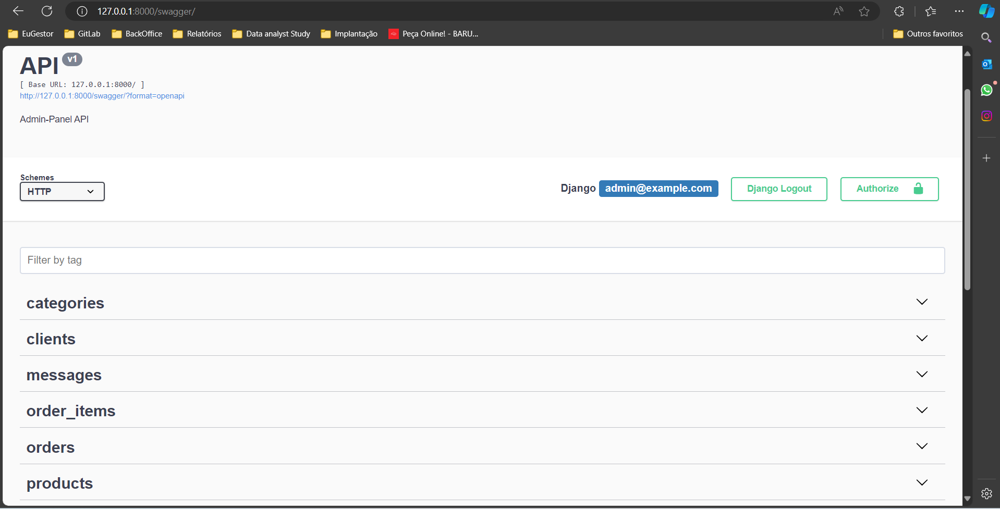
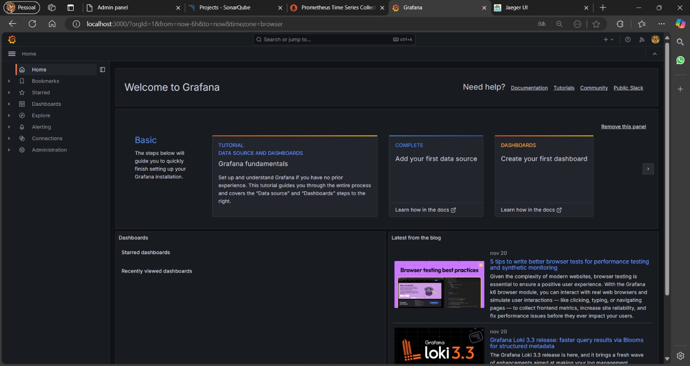
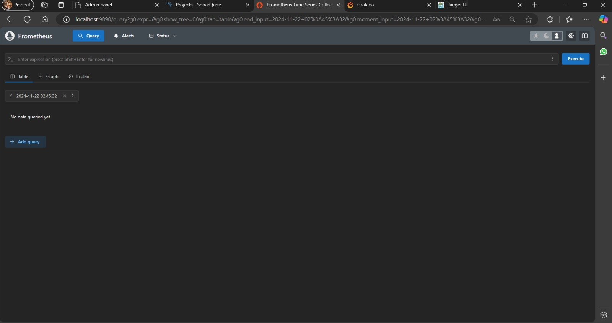
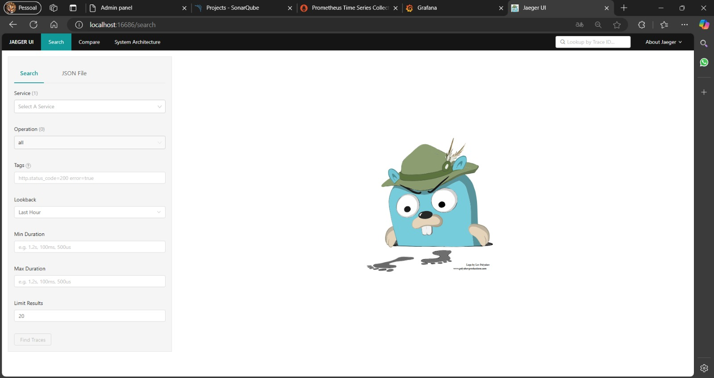
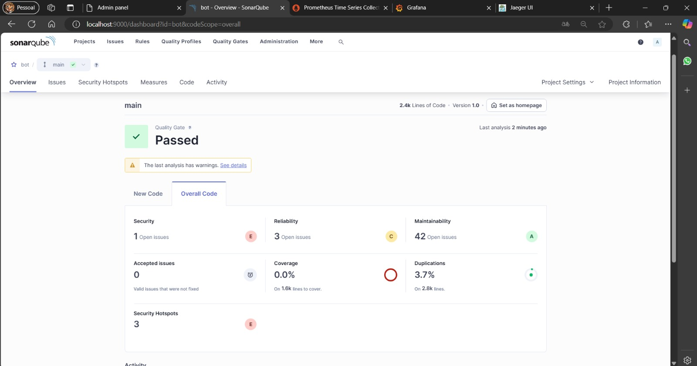

# Bot-Telegram-Python 🤖

Este é um bot para o Telegram desenvolvido em Python, projetado para facilitar vendas e oferecer uma interface amigável tanto para usuários quanto para administradores.

## 📋 Funcionalidades

- ✅ **Gerenciamento de vendas** diretamente no Telegram.
- ✅ **Painel administrativo** para acompanhamento e configuração.
- ✅ **Integração com APIs externas** e suporte a Docker.
- ✅ **Documentação da API** com Swagger.
- ✅ **Monitoramento** utilizando Grafana, Prometheus e Jaeger.
- ✅ **Qualidade de Código** garantida com SonarQube.
- ✅ **Fácil configuração e escalabilidade**.

## 📑 Menu

- [Funcionalidades](#-funcionalidades)
- [Começando](#-começando)
  - [Pré-requisitos](#pré-requisitos)
  - [Instalação](#instalação)
- [Documentação](#-documentação)
- [Tecnologias Utilizadas](#-tecnologias-utilizadas)

## 🚀 Começando

### Pré-requisitos

- Docker
- Docker Compose

### Instalação

#### Rodando Localmente (No arquivo .env mantenha como DB_HOST=localhost)

1. Clone o repositório:
    ```bash
    git clone https://github.com/seu-usuario/bot-telegram-python.git
    cd bot-telegram-python
    ```

2. Instale as dependências:
    ```bash
    pip install -r requirements.txt
    ```

3. Rodando Localmente:
    ```bash
    python manage.py runserver
    ```

4. Abra um novo terminal e Execute o bot:
    ```bash
    python -m bot.bot
    ```

#### Rodando com Docker (No arquivo .env altere para DB_HOST=db)

1. Clone o repositório:
    ```bash
    git clone https://github.com/seu-usuario/bot-telegram-python.git
    cd bot-telegram-python
    ```

2. Construa e inicie os serviços usando Docker Compose:
    ```bash
    docker-compose up --build
    ```

## 📚 Documentação

- **Swagger**: Acesse a documentação da API em [http://localhost:8000/swagger](http://localhost:8000/swagger)
  

- **Grafana**: Interface para monitoramento em [http://localhost:3000](http://localhost:3000)
  

- **Prometheus**: Métricas do sistema em [http://localhost:9090](http://localhost:9090)
  

- **Jaeger**: Rastreamento distribuído em [http://localhost:16686](http://localhost:16686)
  

  **SonarQube**: Qualidade do código em [http://localhost:9000](http://localhost:9000)
  

## 🛠️ Tecnologias Utilizadas

- Python
- Docker
- Docker Compose
- Swagger
- Grafana
- Prometheus
- Jaeger
- SonarQube